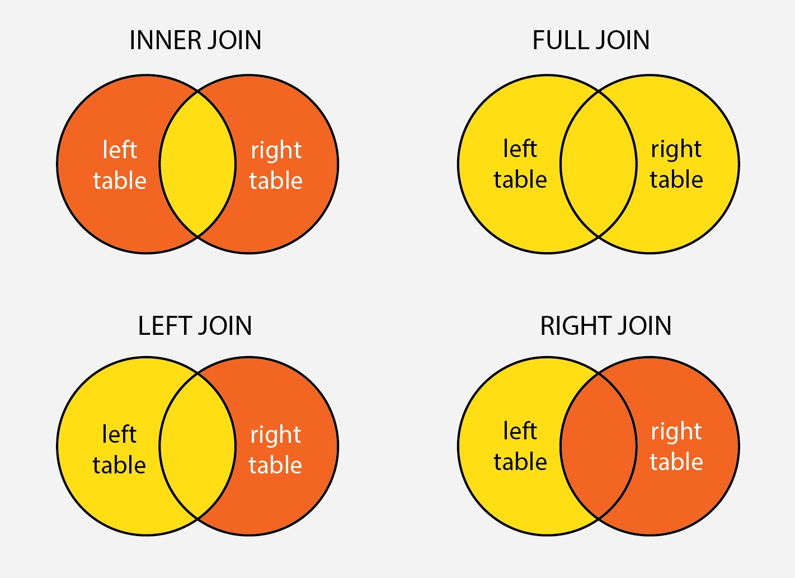

<div align="center">
  <h1>Structured Query Language</h1>
</div>

## Page Layout
    
    ├── Introduction                  
    ├── Create, Use, Delete Database 
    ├── Create Table
    ├── Select Statement
    ├── Select Distinct
    ├── Operators
                ├── And
                ├── Or
                ├── Not
                ├── Like
                ├── Between
    ├── Functions
                ├── MIN()
                ├── MAX()
                ├── COUNT()
                ├── SUM()
                ├── AVG()
    ├──  String Function
                       ├── LTRIM()
                       ├── Lower()
                       ├── Upper()
                       ├── Reverse()
                       ├── Substring ()
    ├── Clause
             ├── Order By Clause
             ├── Top Clause
             ├── Group By Clause
             ├── Having Clause
    ├──Statement
               ├── Update Statement
               ├── Delete Statement
               ├── Truncate Statement
     ├── Join
            ├── Inner join
            ├── Left join
            ├── Right join
            ├── Full join
            ├── Update and Delete using Join
     ├── Operators in Sql
                ├── Union Operator
                ├── Union All Operator
                ├── Except Operator
                ├── Intersect Operator
     ├── Views
             ├──Create Views
             ├── Drop Views
     ├── Alter Table
     ├── Drop column
     ├── Drop Table
     ├── Merge Statement
     ├── User Defined Function
                             ├──Scaler value function
                             ├──Table value function
     ├── Temporary Table
     ├── Case Statement
     ├── IIF() Function
     ├── Stored Procedure
                        ├── Stored Procedure without Parameter
                        ├──Stored Procedure with Parameter
     ├── Exception Handling
                          ├── Try/Catch
                          ├── User Defined Try/Catch
     ├── Transaction 
                              


## Quick Links
* [Introduction](#introduction)
* [Create, Use, Delete Database](#create-use-delete-database)
* [Create Table](#create-table)
* [Select Statement](#select-statement)
* [Select Distinct](#select-distinct)
* [Operators](#operator)
* [Functions](#functions)
* [String Function](#string-function)
* [Clause](#clause)
* [Statement](#statement)
* [Join](#join)
* [Operator in SQL](#operator-in-sql)
* [Views](#views)
* [Alter Table](#alter-table)
* [Drop Column](#drop-column)
* [Drop Table](#drop-table)
* [Merge Statement](#merge-statement)
* [User Defined Function](#user-defined-function)
* [Temporary Table](#temporary-table)
* [Case Statement](#case-statement)
* [IIF() Function](#iif)
* [Stored Procedure](#stored-procedure-in-sql)
* [Exception Handling](#exception-handling)
* [Transaction](#transaction-in-sql)


# Introduction
## Data

In computing, data is information that has been translated into a form that is efficient for movement or processing. Data can come in the form of text, observations, figures, images, numbers, graphs, or symbols. For example, data might include individual prices, weights, addresses, ages, names, temperatures, dates, or distances.


## Database 

A database is information that is set up for easy access, management and updating. Computer databases typically store aggregations of data records or files that contain information, such as sales transactions, customer data, financials and product information.

## Why we need Database?

Databases support good data access because: Large volumes of data can be stored in one place. Multiple users can read and modify the data at the same time. Databases are searchable and sortable, so the data you need can be found quick and easily.

## DBMS

A database management system (or DBMS) is essentially nothing more than a computerized data-keeping system. Users of the system are given facilities to perform several kinds of operations on such a system for either manipulation of the data in the database or the management of the database structure itself.

## SQL

SQL stands for Structured Query Language. SQL is the standard language for dealing with Relational Databases. SQL can be used to insert, search, update, and delete database records.

# Create, Use, Delete Database 

### Create Database
```sql
CREATE DATABASE databasename;
```
### For Using Existing Database
```sql
USE [datbasename];
```

### For Delete any Database
```sql
DROP DATABASE databasename;
```
# Create Table
## For creating fields in table

Example -
```sql
CREATE TABLE employee(
e_id int not null,
e_name varchar(20),
e_salary int,
e_age int,
e_gender varchar(20),
e_dept varchar(20),
primary key(e_id),
);
```

## Inserting the Records

```sql
insert into employee values(
1,'sam', 95000, 45, 'Male', 'Operations'
);
insert into employee values(
2,'bob', 85000, 35, 'Male', 'Support'
);
insert into employee values(
3,'Ana', 125000, 28, 'Male', 'Analyst'
);
insert into employee values(
4,'sama', 5000, 25, 'Female', 'Operations'
);
insert into employee values(
5,'boby', 8000, 21, 'Female', 'Support'
);
insert into employee values(
6,'Anay', 12500, 20, 'Female', 'Analyst'
);
insert into employee values(
7,'mahashin', 985656, 22, 'Male', 'head'
);
```
Result 
```
e_id  e_name   e_salary	e_age	e_gender e_dept
1	sam	95000	45	Male	Operations
2	bob	85000	35	Male	Support
3	Ana	125000	28	Male	Analyst
4	sama	5000	25	Female	Operations
5	boby	8000	21	Female	Support
6	Anay	12500	20	Female	Analyst
7	mahashin 985656	22	Male	head
```
# Select Statement
## Show or Select the entire Record of particular fields
```sql
SELECT e_name FROM employee;
```
Result
```
e_name
sam
bob
Ana
sama
boby
Anay
mahashin
```

## Show or Select the entire Record of multiple fields
```sql
SELECT e_name, e_salary, e_age FROM employee;
```
Result 
```
e_name	e_salary	e_age
sam	95000	         45
bob	85000	         35
Ana	125000           28
sama	5000	         25
boby	8000	         21
Anay	12500	         20
mahashin 985656	         22
```
## For Total Record and Fields of Table
```sql
SELECT * FROM employee;
```
# Select Distinct
## Show or Select the Different Record(values) of particular fields
```sql
SELECT DISTINCT e_gender FROM employee;
```
Result 
```
e_gender
Female
Male
```
## For Filter the Record(Values) from the all table
```sql
SELECT * FROM employee WHERE e_gender = 'female';
```
Result 
```
e_id	e_name	e_salary e_age	e_gender e_dept
4	sama	5000	25	Female	Operations
5	boby	8000	21	Female	Support
6	Anay	12500	20	Female	Analyst
```
(it will show only female gender)
```sql
SELECT * FROM employee WHERE e_salary >10000 ;
```
(it will show only that table whoese salary more than 10000)
# Operator
## SELECT/SHOW ONLY IF BOTH CONDITION ARE TRUE (AND)
```sql
SELECT * FROM employee WHERE e_gender='Male' AND e_age<30;
```
Result
```
e_id	e_name	e_salary e_age	e_gender e_dept
3	Ana	125000	  28	Male	Analyst
7    mahashin	985656	  22	Male	head
```
```sql
SELECT * FROM employee WHERE e_dept='Analyst' AND e_salary>100000;
```
Result
```
e_id	e_name	e_salary e_age	e_gender e_dept
3	Ana	125000	28	Male	Analyst
```

## SELECT/SHOW IF ANY ONE OF THE CONDITION TRUE (OR)
```sql
SELECT * FROM employee WHERE e_dept='Analyst' OR e_dept='Operations';
```
Result
```
1	sam	95000	45	Male	Operations
3	Ana	125000	28	Male	Analyst
4	sama	5000	25	Female	Operations
6	Anay	12500	20	Female	Analyst
```
```sql
SELECT * FROM employee WHERE e_salary>100000 OR e_age<30;
```
Result
```
e_id	e_name	e_salary e_age	e_gender e_dept
3	Ana	125000	28	Male	Analyst
4	sama	5000	25	Female	Operations
5	boby	8000	21	Female	Support
6	Anay	12500	20	Female	Analyst
7      mahashin 985656	22	Male	head
```

## SELECT/SHOW ONLY IF CONDITION ARE NOT TRUE (NOT)
```sql
SELECT * FROM employee WHERE NOT e_gender='Female';
```
Result
```
e_id	e_name	e_salary e_age	e_gender e_dept
1	sam	95000	45	Male	Operations
2	bob	85000	35	Male	Support
3	Ana	125000	28	Male	Analyst
7    mahashin	985656	22	Male	head
```
```sql
SELECT * FROM employee WHERE NOT e_age<30;
```
Result
```
e_id	e_name	e_salary e_age	e_gender e_dept
1	sam	95000	45	Male	Operations
2	bob	85000	35	Male	Support
```

## LIKE Operator used to extract records where a particular pattern is present

Here '%' and ' _ ' are wild card characters '%' Represents Zero, one or Multiple Characters and ' _ ' Represents Single characters.
```sql
SELECT * FROM employee WHERE e_name LIKE 'B%';
```
Result 
```
e_id	e_name	e_salary e_age	e_gender e_dept
2	bob	85000	35	Male	Support
5	boby	8000	21	Female	Support
```

```sql
SELECT * FROM employee WHERE e_age LIKE '3_';
```
Result 
```
e_id	e_name	e_salary e_age	e_gender e_dept
2	bob	85000	35	Male	Support
```
## Between Operator is used to select values with in a Range.
```sql
SELECT * FROM employee WHERE e_salary BETWEEN 50000 AND 100000;
```
Result 
```
1	sam	95000	45	Male	Operations
2	bob	85000	35	Male	Support
```
```sql
SELECT * FROM employee WHERE e_age BETWEEN 25 AND 30;
```
Result 
```
e_id	e_name	e_salary e_age	e_gender e_dept
3	Ana	125000	28	Male	Analyst
4	sama	5000	25	Female	Operations
```
# FUNCTIONS

## MIN() functions gives you the smallest value From record of particular fields.
```sql
SELECT MIN(e_age) FROM employee;
```
Result
```
20
```
```sql
SELECT MIN(e_salary) FROM employee;
```
Result
```
5000
```

## MAX() functions gives you the Biggest value From record of particular fields.
```sql
SELECT MAX(e_age) FROM employee;
```
Result
```
45
```
```sql
SELECT MAX(e_salary) FROM employee;
```
Result
```
985656
```

## COUNT() Function returns the number of rows match the specific criteria
```sql
SELECT COUNT(*) FROM employee WHERE e_gender = 'male';
```
Result
```
4
```
```sql
SELECT COUNT(*) FROM employee WHERE e_gender = 'Female';
```
Result
```
3
```

## SUM() function gives the total sum of numeric column
```sql
SELECT SUM(e_salary) FROM employee;
```
Result
```
1316156
```
## AVG() Function gives the average value of numeric column
```sql
SELECT AVG(e_age) FROM employee;
```
Result
```
28
```
```sql
SELECT AVG(e_salary) FROM employee;
```
Result
```
188022
```

# String Function

## LTRIM() Remove the blanks on the left side of the character expression
```sql
SELECT '     SPARTA';
SELECT LTRIM('     SPARTA');
```

## LOWER() Converts all the characters to lower case letters
```sql
SELECT 'THIS IS TOTALLY DONE FOR PRINCE';
SELECT LOWER('THIS IS TOTALLY DONE FOR PRINCE');
```
Result - this is totally done for prince
## UPPER() Converts all the characters to upper case letters
```sql
SELECT 'this is totally done for prince';
SELECT UPPER('this is totally done for prince');
```
Result - this is totally done for prince
## REVERSE() Converts all the characters in the string
```sql
SELECT 'i love coding';
SELECT REVERSE('i love coding');
```
Result - gnidoc evol i
## SUBSTRING() Give a substring from the orignal string
```sql
SELECT 'i love coding';
SELECT SUBSTRING('i love coding',8,13);
--We get the result coding
```
Result - coding

# CLAUSE

## ORDER BY is use to sort the data in ascending or descending order by default it is on asending order
```SQL
SELECT * FROM employee ORDER BY e_salary;
-- BY DEFAULT IT IS ASSENDING ORDER 
```
RESULT
```
e_id	e_name	e_salary e_age	e_gender e_dept
4	sama	5000	25	Female	Operations
5	boby	8000	21	Female	Support
6	Anay	12500	20	Female	Analyst
2	bob	85000	35	Male	Support
1	sam	95000	45	Male	Operations
3	Ana	125000	28	Male	Analyst
7	mahashin 985656	22	Male	head
```
```SQL
SELECT * FROM employee ORDER BY e_salary DESC;
```

RESULT
```
e_id	e_name	e_salary e_age	e_gender e_dept
7	mahashin 985656	22	Male	head
3	Ana	125000	28	Male	Analyst
1	sam	95000	45	Male	Operations
2	bob	85000	35	Male	Support
6	Anay	12500	20	Female	Analyst
5	boby	8000	21	Female	Support
4	sama	5000	25	Female	Operations
```

## TOP is use to fetch top n(number) records
```sql
SELECT TOP 3 * FROM employee;
```
RESULT
```
e_id	e_name	e_salary e_age	e_gender e_dept
1	sam	95000	45	Male	Operations
2	bob	85000	35	Male	Support
3	Ana	125000	28	Male	Analyst
```

EXAMPLE FOR BOTH 'ORDER BY' AND 'TOP' CLAUSE

```SQL
SELECT TOP 3 * FROM employee ORDER BY e_age DESC;
```
RESULT
```
e_id	e_name	e_salary e_age	e_gender e_dept
1	sam	95000	45	Male	Operations
2	bob	85000	35	Male	Support
3	Ana	125000	28	Male	Analyst
```

## GROUP BY is used to get aggregate result with respect to a group.

```SQL 
SELECT AVG(e_salary), e_gender FROM employee GROUP BY e_gender;
```
RESULT
```
(No column name) e_gender
8500	Female
322664	Male
```
```SQL
SELECT AVG(e_age), e_dept FROM employee GROUP BY e_dept ORDER BY AVG(e_age)DESC;
```
RESULT
```
(No column name)	e_dept
35	Operations
28	Support
24	Analyst
22	head
```

## HAVING CLAUSE is used in combination with GROUP BY to impose the condition on groups

In this Queary firstly it select the avrage salary and department and then arrange group wise salary more than 10000 
```sql
SELECT e_dept, AVG(e_salary) AS avg_salary FROM employee GROUP BY e_dept HAVING AVG(e_salary)>10000;
```
RESULT 
```SQL
e_dept 	avg_salary
Analyst	   68750
head	  985656
Operations 50000
Support	   46500
```

# Statement
## UPDATE is used to modify the existing records in a table.

```sql
UPDATE employee SET e_age=42 WHERE e_name ='sam';
UPDATE employee SET e_dept='tech' WHERE e_gender='female';
UPDATE employee SET e_salary=50000;
SELECT * FROM employee;
```
RESULT
```
e_id	e_name	e_salary e_age	e_gender e_dept
1	sam	50000	42	Male	Operations
2	bob	50000	35	Male	Support
3	Ana	50000	28	Male	Analyst
4	sama	50000	25	Female	tech
5	boby	50000	21	Female	tech
6	Anay	50000	20	Female	tech
7	mahashin 50000	22	Male	head
```

## DELETE statement is use to delete existing records in the table

```sql
DELETE FROM employee where e_age=42;
```
## TRUNCATE Statement deletes all the data inside the table.
```sql
TRUNCATE TABLE employee;
```
Result
```
e_id	e_name	e_salary   e_age   e_gender	e_dept
```
It clear only data but structure of table remain constanst.

# JOIN

First create two table

```sql
-- Table 1
CREATE TABLE department(
d_id int not null,
d_name varchar(20),
d_location varchar(20),
primary key(d_id),
);

insert into department values(
1,'Operations', 'France'
);
insert into department values(
2,'Support', 'Germany'
);
insert into department values(
3,'Analyst', 'Japan'
);
insert into department values(
4,'Head', 'India'
);
insert into department values(
5,'Tester', 'USA'
);
insert into department values(
6,'Security', 'China'
);
insert into department values(
7,'Client', 'Pakistan'
);
```
Result
```
d_id	d_name	     d_location
1	Operations    	France
2	Support	        Germany
3	Analyst	         Japan
4	Head	         India
5	Tester         	USA
6	Security   	China
7	Client  	Pakistan
```
```sql
--Table-2
CREATE TABLE employee(
e_id int not null,
e_name varchar(20),
e_salary int,
e_age int,
e_gender varchar(20),
e_dept varchar(20),
primary key(e_id),
);

insert into employee values(
1,'sam', 95000, 45, 'Male', 'Operations'
);
insert into employee values(
2,'bob', 85000, 35, 'Male', 'Support'
);
insert into employee values(
3,'Ana', 125000, 28, 'Male', 'Analyst'
);
insert into employee values(
4,'sama', 5000, 25, 'Female', 'Operations'
);
insert into employee values(
5,'boby', 8000, 21, 'Female', 'Support'
);
insert into employee values(
6,'Anay', 12500, 20, 'Female', 'Analyst'
);
insert into employee values(
7,'mahashin', 985656, 22, 'Male', 'head'
);
insert into employee values(
8,'Prince', 1000000, 35, 'Male', 'CEO'
);
```
Result
```
e_id	e_name	e_salary e_age	e_gender e_dept
1	sam	95000	45	Male	Operations
2	bob	85000	35	Male	Support
3	Ana	125000	28	Male	Analyst
4	sama	5000	25	Female	Operations
5	boby	8000	21	Female	Support
6	Anay	12500	20	Female	Analyst
7	mahashin 985656	22	Male	head
8	Prince	1000000	35	Male	CEO
```

## INNER JOIN returns records that have matching values in both the table. It is also known as simple join.


```sql
SELECT employee.e_name, employee.e_dept, department.d_name, department.d_location
FROM employee
INNER JOIN department 
ON employee.e_dept=department.d_name;
```
RESULT
```
e_name	e_dept      d_name   d_location
sam	Operations Operations	France
bob	Support     Support	Germany
Ana	Analyst     Analyst	Japan
sama	Operations  Operations	France
boby	Support     Support	Germany
Anay	Analyst     Analyst	Japan
mahashin head        Head	India
```
## LEFT JOIN returns all the records from the left table, and the matched records from the right table.

```sql
SELECT employee.e_name, employee.e_dept, department.d_name, department.d_location 
FROM employee
LEFT JOIN department 
ON employee.e_dept=department.d_name;
```
RESULT
```
e_name	e_dept    d_name	d_location
sam	Operations Operations	France
bob	Support    Support	Germany
Ana	Analyst    Analyst	Japan
sama	Operations Operations	France
boby	Support  Support	Germany
Anay	Analyst  Analyst	Japan
mahashin head    Head   	India
Prince   CEO     NULL   	NULL
```
## RIGHT JOIN return all the records from the right table and matched records from left.

```sql
SELECT employee.e_name, employee.e_dept, department.d_name, department.d_location
FROM employee
RIGHT JOIN department 
ON employee.e_dept=department.d_name;
```
RESULT
```
e_name	e_dept   d_name       d_location
sam	Operations Operations	France
sama	Operations Operations	France
bob	Support	   Support	Germany
boby	Support	   Support	Germany
Ana	Analyst    Analyst	Japan
Anay	Analyst	   Analyst  	Japan
mahashin head	   Head	        India
NULL	NULL	   Tester      	USA
NULL	NULL	   Security	China
NULL	NULL	   Client	Pakistan
```
## FULL JOIN all rows from the LEFT table and RIGHT table with NULL values in place where the join condition is not met.

```sql
SELECT employee.e_name, employee.e_dept, department.d_name, department.d_location
FROM employee
FULL JOIN department 
ON employee.e_dept=department.d_name;
```
RESULT
```
e_name	e_dept    d_name	d_location
sam	Operations  Operations	France
bob	Support     Support	Germany
Ana	Analyst     Analyst	Japan
sama	Operations  Operations	France
boby	Support	    Support	Germany
Anay	Analyst	    Analyst	Japan
mahashin head       Head	India
Prince	CEO         NULL	NULL
NULL	NULL	    Tester	USA
NULL	NULL	    Security	China
NULL	NULL	    Client	Pakistan
```

## UPDATE using Join

```sql
UPDATE employee
SET e_age=e_age+50
FROM employee
JOIN department ON employee.e_dept=department.d_name
WHERE d_location='Japan';
```
Here Analyst age has been change because it mached with department loaction japan.

RESULT
```
e_id	e_name	e_salary e_age	e_gender e_dept
1	sam	95000	45	Male	Operations
2	bob	85000	35	Male	Support
3	Ana	125000	78	Male	Analyst
4	sama	5000	25	Female	Operations
5	boby	8000	21	Female	Support
6	Anay	12500	70	Female	Analyst
7	mahashin 985656	22	Male	head
8	Prince	1000000	35	Male	CEO
```

## DELETE using Join
```sql
DELETE employee
FROM employee
JOIN department ON employee.e_dept=department.d_name
WHERE d_location='Japan';
```
Here Analyst has been deleted because it mached with department loaction japan.

RESULT
```
e_id	e_name	e_salary e_age	e_gender e_dept
1	sam	95000	45	Male	Operations
2	bob	85000	35	Male	Support
4	sama	5000	25	Female	Operations
5	boby	8000	21	Female	Support
7	mahashin 985656	22	Male	head
8	Prince	1000000	35	Male	CEO
```

# Operator in SQL

Create Two Table

```sql
CREATE TABLE Student_Details1(
s_id int not null,
s_name varchar(20),
s_marks int,
primary key(s_id),
);

insert into Student_Details1 values(
1,'sam', 45
);
insert into Student_Details1 values(
2,'bob', 89
);
insert into Student_Details1 values(
3,'Ana', 65
);
insert into Student_Details1 values(
4,'sama', 69
);

CREATE TABLE Student_Details2(
s_id int not null,
s_name varchar(20),
s_marks int,
primary key(s_id),
);

insert into Student_Details2 values(
3,'Ana', 65
);
insert into Student_Details2 values(
4,'sama', 69
);
insert into Student_Details2 values(
5,'jai', 37
);
insert into Student_Details2 values(
6,'viru', 62
);
```
## Union Operator - is used to combine the data from the result of two or more SELECT command queries into a single distinct result set.

```sql
SELECT * FROM Student_Details1
UNION
SELECT * FROM Student_Details2;
```
RESULT
```
s_id	s_name	s_marks
1	sam	45
2	bob	89
3	Ana	65
4	sama	69
5	jai	37
6	viru	62
```

## Union All Operator - give all the rows from both the table including the duplicates.

```sql
SELECT * FROM Student_Details1
UNION ALL
SELECT * FROM Student_Details2;
```
RESULT
```
s_id	s_name	s_marks
1	sam	45
2	bob	89
3	Ana	65
4	sama	69
3	Ana	65
4	sama	69
5	jai	37
6	viru	62
```

## Except Operator - Combines two select statements and returns unique records from left query which are not part of the right query;

```sql
SELECT * FROM Student_Details1
EXCEPT
SELECT * FROM Student_Details2;
```
RESULT
```
s_id	s_name	s_marks
1	sam	45
2	bob	89
```

## INTERSECT Operator helps to combine two select statements and returns the records which are common to both the select statements.
```sql
SELECT * FROM Student_Details1
INTERSECT
SELECT * FROM Student_Details2;
```
RESULT
```
s_id	s_name	s_marks
3	Ana	65
4	sama	69
```

# VIEWS
  is a virtual table based on the result of an sql Statement.
## CREATE VIEW - Creates a virtual table whose contents (columns and rows) are defined by a query. Use this statement to create a view of the data in one or more tables in the database.

```sql
CREATE VIEW female_employees AS
SELECT * FROM employee
WHERE e_gender = 'female';
```
For checking the view 
```sql
SELECT * FROM female_employees;
```
RESULT
```
e_id	e_name	e_salary e_age	e_gender e_dept
4	sama	5000	25	Female	Operations
5	boby	8000	21	Female	Support
```
## DROP VIEW - command deletes a view

```sql
DROP VIEW female_employees;
```
For checking the view exist or not
```sql
SELECT * FROM female_employees;
```

# ALTER TABLE 

## Statement is use to add, delete or modify columns in the table.
For adding the new field in the table.
```sql
ALTER TABLE employee
ADD e_dob date;
```
```sql
SELECT * FROM employee;
```
RESULT 
```
e_id	e_name	e_salary e_age	e_gender e_dept    e_dob
1	sam	95000	45	Male	Operations  NULL
2	bob	85000	35	Male	Support     NULL
4	sama	5000	25	Female	Operations  NULL
5	boby	8000	21	Female	Support     NULL
7	mahashin 985656	22	Male	head        NULL
8	Prince	1000000	35	Male	CEO         NULL
```
# Drop Column 

```sql
ALTER TABLE employee
DROP COLUMN e_dob;
```
RESULT 
```
e_id	e_name	e_salary e_age	e_gender e_dept 
1	sam	95000	45	Male	Operations  
2	bob	85000	35	Male	Support     
4	sama	5000	25	Female	Operations  
5	boby	8000	21	Female	Support     
7	mahashin 985656	22	Male	head        
8	Prince	1000000	35	Male	CEO         
```
# Drop Table
## The DROP TABLE statement is used to drop an existing table in a database.
```sql
DROP TABLE employee;
```
# Merge Statement
## Merge is combination of Insert, Delete and Update At one statement.

```sql
-- Table 1 
CREATE TABLE Employee_Target(
e_id int not null,
e_name varchar(20),
e_salary int,
e_age int,
e_gender varchar(20),
e_dept varchar(20),
primary key(e_id),
);
insert into Employee_Target values(
1,'sam', 93000, 40, 'Male', 'Operations'
);
insert into Employee_Target values(
2,'bob', 85000, 35, 'Male', 'Support'
);
insert into Employee_Target values(
3,'Ana', 130000, 25, 'Male', 'Analyst'
);
insert into Employee_Target values(
6,'sama', 5000, 25, 'Female', 'Operations'
);
insert into Employee_Target values(
7,'boby', 8000, 21, 'Female', 'Content'
);
insert into Employee_Target values(
8,'Anay', 12500, 20, 'Female', 'Tech'
);
```
RESULT
```
e_id	e_name	e_salary e_age	e_gender e_dept
1	sam	93000	40	Male	Operations
2	bob	85000	35	Male	Support
3	Ana	130000	25	Male	Analyst
6	sama	5000	25	Female	Operations
7	boby	8000	21	Female	Content
8	Anay	12500	20	Female	Tech
```

```sql
--  Table 2
CREATE TABLE Employee_Source(
e_id int not null,
e_name varchar(20),
e_salary int,
e_age int,
e_gender varchar(20),
e_dept varchar(20),
primary key(e_id),
);
insert into Employee_Source values(
1,'sam', 95000, 45, 'Male', 'Operations'
);
insert into Employee_Source values(
2,'bob', 85000, 35, 'Male', 'Support'
);
insert into Employee_Source values(
3,'Ana', 125000, 28, 'Male', 'Analyst'
);
insert into Employee_Source values(
4,'mahashin', 985656, 22, 'Male', 'Analyst'
);
insert into Employee_Source values(
5,'Matt', 80000, 22, 'Male', 'Sales'
);
insert into Employee_Source values(
8,'sama', 5000, 25, 'Male', 'Content'
);
```
RESULT
```
e_id	e_name	e_salary e_age	e_gender e_dept
1	sam	95000	45	Male	Operations
2	bob	85000	35	Male	Support
3	Ana	125000	28	Male	Analyst
4	mahashin 985656	22	Male	Analyst
5	Matt	80000	22	Male	Sales
8	sama	5000	25	Male	Content
```

```sql
MERGE Employee_Target AS T
USING Employee_Source AS S
ON T.e_id=S.e_id
WHEN MATCHED
THEN UPDATE SET T.e_salary=S.e_salary, T.e_age=S.e_age
WHEN NOT MATCHED BY TARGET
THEN INSERT (e_id,e_name,e_salary,e_age,e_gender,e_dept)
VALUES(S.e_id,S.e_name,S.e_salary,S.e_age,S.e_gender,S.e_dept)
WHEN NOT MATCHED BY SOURCE 
THEN DELETE;
```
Condition-  source e_id = Target e_id 
* If matched it update e_age, e_salary accordiing to the source table. 
* If not match then 
 i) Extra data Avilable on Source table added to the target table and
 ii) Extra data avilable on the Target table has been deleted.
* All the changes apper in the target table.

```sql
SELECT * FROM Employee_Target; 
```
RESULT for Target Table
```
e_id	e_name	e_salary e_age	e_gender e_dept
1	sam	95000	45	Male	Operations
2	bob	85000	35	Male	Support
3	Ana	125000	28	Male	Analyst
4	mahashin 985656	22	Male	Analyst
5	Matt	80000	22	Male	Sales
8	Anay	5000	25	Female	Tech
```

# User Defined Function

## Scaler value function - always returns a scaler value function.

It will take one integer value add 5 more to orignal vaule and return the updated value.

```sql
CREATE FUNCTION add_five(@num as int)
RETURNS INT
AS
BEGIN
RETURN(
@NUM+5
)
END;
```
Implementation
```sql
SELECT dbo.add_five(100);
```
Result - 105

## Table value function - returns a table.

```sql
SELECT * FROM employee;
```
RESULT
```
e_id	e_name	e_salary e_age	e_gender e_dept	
1	sam	95000	45	Male	Operations	
2	bob	85000	35	Male	Support	
4	sama	5000	25	Female	Operations	
5	boby	8000	21	Female	Support	
7	mahashin 985656	22	Male	head	
8	Prince	1000000	35	Male	CEO	
```
Code for Scaler
```sql
CREATE FUNCTION select_gender(@gender AS VARCHAR(20))
RETURNS TABLE
AS
RETURN 
(
SELECT * FROM employee WHERE e_gender=@gender
)
```
Check for implementation
```sql
SELECT * FROM DBO.select_gender('Male')
```
Result
```
e_id	e_name	e_salary e_age	e_gender e_dept	
1	sam	95000	45	Male	Operations	
2	bob	85000	35	Male	Support
7	mahashin 985656	22	Male	head	
8	Prince	1000000	35	Male	CEO	
```
Check for implementation
```sql
SELECT * FROM DBO.select_gender('Female')
```
Result
```
e_id	e_name	e_salary e_age	e_gender e_dept	
4	sama	5000	25	Female	Operations	
5	boby	8000	21	Female	Support	
```

# Temporary Table
### are created in tempDB and deleted as soon as the session is terminated.

```sql
CREATE TABLE #student(
s_id INT,
s_name varchar(20)
);
```
```sql
INSERT INTO #student VALUES (
1, 'Suman'
);
```
* Just use # before name of table it will be Temporary table.

# Case Statement 
## - helps in multi way decision making.
Example-1
```sql
SELECT 
CASE 
WHEN 10>20 THEN '10 IS GREATER THAN 20'
WHEN 20>10 THEN '10 IS LESS THAN 20'
ELSE '10 IS EQUAL TO 20'
END
```
Example-2
```sql
SELECT * FROM employee;
```
Result
```
e_id	e_name	e_salary e_age	e_gender e_dept	
1	sam	95000	45	Male	Operations	
2	bob	85000	35	Male	Support	
4	sama	5000	25	Female	Operations	
5	boby	8000	21	Female	Support	
7	mahashin 985656	22	Male	head	
8	Prince	1000000	35	Male	CEO	
```
```sql
SELECT * ,grade=
CASE
WHEN e_salary<50000 THEN 'C'
WHEN e_salary<100000 THEN 'B'
ELSE 'A'
END 
FROM employee
GO
```
RESULT
```
e_id	e_name	e_salary e_age	e_gender e_dept	   grade
1	sam	95000	45	Male	Operations   B
2	bob	85000	35	Male	Support	     B
4	sama	5000	25	Female	Operations   C
5	boby	8000	21	Female	Support      C
7	mahashin 985656	22	Male	head         A
8	Prince	1000000	35	Male	CE           A
```

# IIF()
## function is an alternative for the case staement 
Example-1
```sql
SELECT 
IIF(10>20,'10 is grater than 20','10 is lesser than 20');
```
Result
```
10 is lesser than 20
```
Example-2
```sql
SELECT * FROM employee;
```
Result
```
e_id	e_name	e_salary e_age	e_gender e_dept
1	sam	95000	45	Male	Operations
2	bob	85000	35	Male	Support
4	sama	5000	25	Female	Operations
5	boby	8000	21	Female	Support
7	mahashin 985656	22	Male	head
8	Prince	1000000	35	Male	CEO
```
```sql
SELECT e_id,e_name,e_age, IIF(e_age>30,'Old Employee','Young Employee') AS employee_generation FROM employee;
```
Result
```
e_id	e_name	e_age	employee_generation
1	sam	45	Old Employee
2	bob	35	Old Employee
4	sama	25	Young Employee
5	boby	21	Young Employee
7	mahashin 22	Young Employee
8	Prince	35	Old Employee
```
# Stored Procedure in SQL

```sql
SELECT * FROM employee;
```
Result
```
e_id	e_name	e_salary e_age	e_gender e_dept
1	sam	95000	45	Male	Operations
2	bob	85000	35	Male	Support
4	sama	5000	25	Female	Operations
5	boby	8000	21	Female	Support
7	mahashin 985656	22	Male	head
8	Prince	1000000	35	Male	CEO
```
## STORED PROCEDURE is a prepared sql code which can be saved and reused.(Without Parameter)
Example-1

For creation of the procedure
```sql
CREATE PROCEDURE employee_age
AS
SELECT e_age FROM employee
GO;
```
For execution
```sql
EXEC employee_age;
```
Result
```sql
e_age
45
35
25
21
22
35
```

Example-2

For creation of the procedure of total employee details
```sql
CREATE PROCEDURE employee_details
AS
SELECT * FROM employee
GO;
```
For execution 
```sql
EXEC employee_details;
```
Result
```
e_id	e_name	e_salary e_age	e_gender e_dept
1	sam	95000	45	Male	Operations
2	bob	85000	35	Male	Support
4	sama	5000	25	Female	Operations
5	boby	8000	21	Female	Support
7	mahashin 985656	22	Male	head
8	Prince	1000000	35	Male	CEO
```
## Stored Procedure with parameter Syntax

```sql
CREATE PROCEDURE employee_gender @gender VARCHAR(20)
AS
SELECT * FROM employee
WHERE e_gender=@gender
GO
```
For execusion

```sql
EXEC employee_gender @gender='Female';
```
Result
```sql
e_id	e_name	e_salary e_age	e_gender e_dept
4	sama	5000	25	Female	Operations
5	boby	8000	21	Female	Support
```

# Exception Handling 
Exception-A error condition during a program execution is called an exception.

Exception Handling - The Machanism for resolving such an exception is exception handling.

## Try/catch - SQL provide Try/Catch blockes for exception handling.

```SQL
DECLARE @val1 int;
DECLARE @val2 int;

BEGIN TRY 
SET @val1=8;
SET @val2=@val1/0;
END TRY

BEGIN CATCH
PRINT error_message()
END CATCH
```
Result- Divide by zero error encountered.

## User Defined Try/Catch
```sql
SELECT * FROM employee;
```
Result
```
e_id	e_name	e_salary e_age	e_gender e_dept
1	sam	95000	45	Male	Operations
2	bob	85000	35	Male	Support
4	sama	5000	25	Female	Operations
5	boby	8000	21	Female	Support
7	mahashin 985656	22	Male	head
8	Prince	1000000	35	Male	CEO
```

```sql
BEGIN TRY 
SELECT e_salary+e_name FROM employee
END TRY

BEGIN CATCH
PRINT 'Cannot add a numerical value with a string'
END CATCH
go
```
Result - Cannot add a numerical value with a string.

# Transaction in SQL
Transaction is a group of command that change data stored in database.
* Transation is created as one single unit.
* Transation ensure that all of the command run succesfully either non of these.
* If any one of the command under transation fails then any changes happens in data will rollback to its original form.
* If all of the command under the transation run sucessfully then it will be commited.

```sql
SELECT * FROM employee;
```
Result
```
e_id	e_name	e_salary e_age	e_gender e_dept
1	sam	95000	45	Male	Operations
2	bob	85000	35	Male	Support
4	sama	5000	25	Female	Operations
5	boby	8000	21	Female	Support
7	mahashin 985656	22	Male	head
8	Prince	1000000	35	Male	CEO
```
Example-1
```sql
BEGIN TRANSACTION
UPDATE employee SET e_age=30 WHERE e_name='sam'
```
```sql
SELECT * FROM employee;
```
Result
```
e_id	e_name	e_salary e_age	e_gender e_dept
1	sam	95000	30	Male	Operations
2	bob	85000	35	Male	Support
4	sama	5000	25	Female	Operations
5	boby	8000	21	Female	Support
7	mahashin 985656	22	Male	head
8	Prince	1000000	35	Male	CEO
```
If we provide rollback command it will get back to orignal form
```sql
ROLLBACK TRANSACTION
```
Result
```
1	sam	95000	45	Male	Operations
2	bob	85000	35	Male	Support
4	sama	5000	25	Female	Operations
5	boby	8000	21	Female	Support
7	mahashin 985656	22	Male	head
8	Prince	1000000	35	Male	CEO
```
But if we use commit command instead of rollback change will be permanent.
```sql
COMMIT TRANSACTION
```
Result
```
e_id	e_name	e_salary e_age	e_gender e_dept
1	sam	95000	30	Male	Operations
2	bob	85000	35	Male	Support
4	sama	5000	25	Female	Operations
5	boby	8000	21	Female	Support
7	mahashin 985656	22	Male	head
8	Prince	1000000	35	Male	CEO
```
Example - 2 with Try catch method.

## Part - 1
```sql
BEGIN TRY
BEGIN TRANSACTION
UPDATE employee SET e_salary=50 where e_gender='Male'
UPDATE employee SET e_salary=195/0 where e_gender='Female'
COMMIT TRANSACTION
PRINT 'Transation is committed'
END TRY
BEGIN CATCH
ROLLBACK TRANSACTION
PRINT 'Transation is rollbacked'
end catch
```
Result- Transation is rollbacked

Reason for Rollback is anynumber cannot divided by zero.(see the case of female in line-4)

```sql
SELECT * FROM employee;
```
Result
```
e_id	e_name	e_salary e_age	e_gender e_dept
1	sam	95000	45	Male	Operations
2	bob	85000	35	Male	Support
4	sama	5000	25	Female	Operations
5	boby	8000	21	Female	Support
7	mahashin 985656	22	Male	head
8	Prince	1000000	35	Male	CEO
```
## Part - 2
```sql
BEGIN TRY
BEGIN TRANSACTION
UPDATE employee SET e_salary=50 where e_gender='Male'
UPDATE employee SET e_salary=195 where e_gender='Female'
COMMIT TRANSACTION
PRINT 'Transation is committed'
END TRY
BEGIN CATCH
ROLLBACK TRANSACTION
PRINT 'Transation is rollbacked'
end catch
```
Result - Transation is committed.

Reason - Error not found.

```sql
SELECT * FROM employee;
```
Result
```
e_id	e_name	e_salary e_age	e_gender e_dept
1	sam	50	45	Male	Operations
2	bob	50	35	Male	Support
4	sama	195	25	Female	Operations
5	boby	195	21	Female	Support
7	mahashin 50	22	Male	head
8	Prince	50	35	Male	CEO
```

## Let's Connect
[](https://www.linkedin.com/in/prince-prasad/)
[](https://twitter.com/PRINCE__PRASAD)
[](https://github.com/PRINCE-PRASAD)